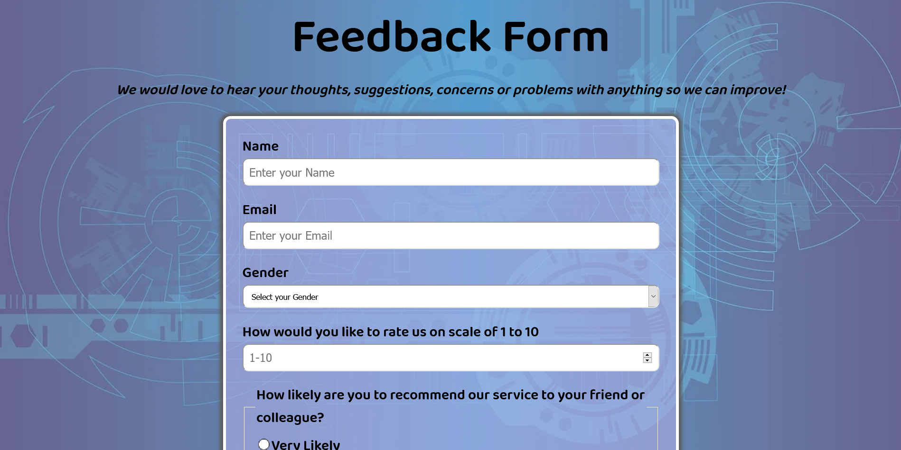

# FreeCodeCamp - Survey Form Solution

This is a solution to the [Build a Survey Form](https://www.freecodecamp.org/learn/responsive-web-design/responsive-web-design-projects/build-a-survey-form).  

## Table of contents

- [Overview](#overview)
  - [The challenge](#the-challenge)
  - [Screenshot](#screenshot)
  - [Links](#links)
- [My process](#my-process)
  - [Built with](#built-with)
  - [What I learned](#what-i-learned)
- [Author](#author)

## Overview

### The challenge

The challenge is to fulfill the user-stories given in the challenge and build a survey form, applying desing as per your choice. 

### Screenshot



### Links

- Solution URL: [Solution](https://github.com/junaidshaikh-js/survey-form)
- Live Site URL: [Live Site](https://junaidshaikh-js.github.io/survey-form/)

## My process

### Built with

- Semantic HTML5 markup
- CSS custom properties
- Flexbox
- Media queries used to make responsive site

### What I learned

In this challenge, I tried flexbox and got familiar with using it. I used different types of input to make the survey form. I used different pseudo selectors to target and style the html elements. 

```css
body::before{
    content: "";
    position: fixed;
    top: 0px;
    left: 0px;
    right: 0px;
    bottom: 0px;
    height: 100vh;
    width: 100vw;
    z-index: -1;
    background: url('https://cdn.pixabay.com/photo/2016/10/11/21/43/geometric-1732847_1280.jpg') no-repeat center center/cover;
background-color: #9e9efd;
    opacity: 0.7;
}
```
The use of `::before` pseudo element was bit difficult to understand, I used this to add background image to the body element and used `bakcground` shorthand property to do the same.

## Author

- Linkedin Profile - [Junaid Shaikh](https://www.linkedin.com/in/junaidshaikhjs/)
